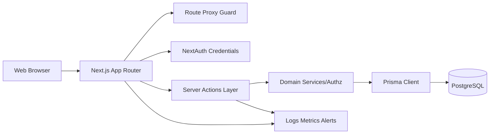

# StudyCoach Architecture Revision (Local Pilot -> Online)

## Goals

- Support real-user pilot testing safely in local environment.
- Be production-ready for online rollout with controlled DB changes, security hardening, and observability.
- Keep current Next.js App Router + Server Actions development model while adding enterprise-grade guardrails.

## Target Architecture

## Runtime Topology (Best-in-class baseline)

1. **Edge of app**
   - Request-level route access checks in `src/proxy.ts`.
   - Session auth in `src/auth.ts`.
2. **Application core**
   - All mutations/queries via server actions in `src/app/actions/*`.
   - Role/ownership checks in `src/lib/authz.ts` and action boundary.
3. **Data layer**
   - Prisma as the only DB gateway (`src/lib/prisma.ts`).
   - Migration-first schema evolution (production).
4. **Operations**
   - Health endpoint + structured logs + CI quality gates.

## Local Pilot vs Online Production

### Phase 1: Local Real-User Pilot
- Keep fast iteration flow:
  - `NODE_ENV=development`
  - schema sync can use `prisma db push`
- Enable demo users only when explicitly needed:
  - `NEXT_PUBLIC_ENABLE_DEMO_ACCOUNTS=true` for demo sessions
- Execute full test suite and manual acceptance checks before each pilot batch.

### Phase 2: Online Rollout
- Enforce migration-first:
  - committed `prisma/migrations/*`
  - deploy with `prisma migrate deploy`
- Disable demo credentials:
  - `NEXT_PUBLIC_ENABLE_DEMO_ACCOUNTS=false`
- Add operational capabilities:
  - structured application logs
  - auth/audit event logs
  - metrics and alerts

## Implemented Hardening Adjustments

1. **Safe callback redirects**
   - Added callback path sanitizer: `src/lib/url.ts`
   - Login now accepts only internal callback paths: `src/app/login/login-form.tsx`
2. **Demo credential exposure control**
   - Demo UI is now gated by `NEXT_PUBLIC_ENABLE_DEMO_ACCOUNTS`:
     - `src/app/login/login-form.tsx`
     - `src/app/login/page.tsx`
3. **Production DB safety gate**
   - Container entrypoint now:
     - uses `prisma migrate deploy` in production
     - fails if migrations are missing
     - keeps `db push` only for non-production
   - file: `docker-entrypoint.sh`
4. **Environment contract for teams**
   - added `.env.example`
   - documented runtime rules in `README.md`

## Required Next Adjustments (High Priority)

1. Add and commit baseline migrations (`prisma migrate dev` + `prisma migrate deploy` path).
2. Introduce login throttling/rate limits (IP + email keyed).
3. Add token expiry for guardian invites in schema and actions.
4. Add structured audit events for:
   - auth failures
   - invite acceptance
   - role-sensitive actions.

